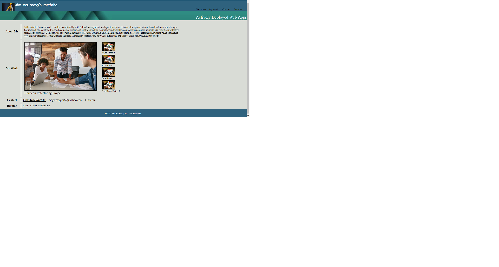

# Jim-Portfolio

## Description

 A portfolio of work can showcase my skills and talents to employers looking to fill a part-time or full-time position. This project creates an effective portfolio highlights my strongest work as well as the thought processes behind it. 
 
 During this project I learned to importance of using flex-box techniques and media queries to actviely adjust display to different screen sizes, as how make better use of CSS by consoldating redundent clasess.

## Usage

To use the Horiseon Marketng Solution website, please vist <https://mcgreevyjim66.github.io/Jims-Portfolio/>

## Source

My repo, is located at <https://github.com/mcgreevyjim66/Jims-Portfolio>.
There is source code located in the Horiseon-Refactor folder, as well as in the ./assets/images and ./assets/css folders.

## Mock-up

## Credits

Author: Jim McGreevy
Date:   7/12/2023

